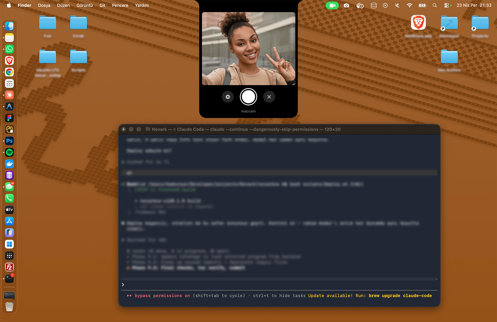

# MacCam — Notch Island Camera for macOS

<p align="center">
  
  
  
  
</p>

<p align="center">
  <strong>Turn your MacBook's dead notch area into a live camera — Dynamic Island style.</strong>
</p>

<p align="center">
  A lightweight, native macOS menu bar app that transforms the notch into a quick-access camera panel. Click the camera icon, and a sleek panel deploys from the notch with a smooth animation, showing your live camera feed. Snap a photo instantly.
</p>

<p align="center">
  
</p>

---

## Features

- **Dynamic Island UI** — Panel emerges from the notch with concave curves, matching Apple's design language
- **Animated Deploy** — Smooth reveal animation from the notch downward
- **Live Camera Preview** — Real-time feed from your Mac's built-in camera
- **One-Click Capture** — Take photos with a single click, flash feedback included
- **Frosted Glass Backdrop** — Optional full-screen blur effect when the camera is open
- **Customizable Save Location** — Choose where your photos are saved (defaults to Desktop)
- **Menu Bar Only** — No dock icon, no clutter. Lives quietly in your menu bar
- **ESC to Close** — Quick dismiss with keyboard or click outside
- **Native Swift** — No Electron, no web views. Pure AppKit + SwiftUI + AVFoundation
- **Lightweight** — Under 1MB, zero dependencies, instant launch

## Install

**One-line install** (requires Xcode Command Line Tools):

```bash
curl -fsSL https://raw.githubusercontent.com/badursun/MacCam-NotchIsland/main/install.sh | bash
```

This will clone, build, code-sign, copy to `/Applications`, and launch MacCam.

### Manual Install

```bash
git clone https://github.com/badursun/MacCam-NotchIsland.git
cd MacCam-NotchIsland
chmod +x build.sh
./build.sh
open build/MacCam.app
```

## Uninstall

```bash
curl -fsSL https://raw.githubusercontent.com/badursun/MacCam-NotchIsland/main/uninstall.sh | bash
```

Or manually: delete `/Applications/MacCam.app`.

## Usage

| Action | How |
|--------|-----|
| Open camera | Click the camera icon in the menu bar |
| Take photo | Click the white shutter button |
| Open settings | Click the gear icon |
| Close panel | Click X, press ESC, or click outside |
| Quit app | Right-click the menu bar icon → "MacCam'i Kapat" |

### Settings

- **Save Directory** — Pick any folder for your photos (default: Desktop)
- **Backdrop Blur** — Toggle the frosted glass overlay on/off in real-time

## Requirements

- macOS 13 (Ventura) or later
- MacBook with notch (MacBook Pro 14"/16" 2021+, MacBook Air 2022+)
- Works on non-notch Macs too — panel appears at the top center of the screen
- Xcode Command Line Tools (for building from source)

## Architecture

```
Sources/MacCam/
├── main.swift                 # App entry point
├── AppDelegate.swift          # NSApp lifecycle, accessory mode
├── StatusBarController.swift  # Menu bar icon, window management, animations
├── NotchWindow.swift          # Borderless NSPanel for the camera UI
├── ContentView.swift          # SwiftUI UI + DynamicIslandShape
├── CameraManager.swift        # AVFoundation session & capture
├── PhotoCaptureDelegate.swift # Photo save handler
├── SettingsManager.swift      # UserDefaults-backed preferences
└── CameraPreviewView.swift    # NSViewRepresentable camera preview
```

**No Xcode project required.** Built entirely with Swift Package Manager.

## How It Works

1. **NSStatusItem** places a camera icon in the menu bar
2. On click, a borderless **NSPanel** is created at the top of the screen
3. The panel uses a custom **DynamicIslandShape** — wide at the top (flush with the screen edge), concave curves narrowing to the content body, rounded bottom corners
4. **AVCaptureSession** provides the live camera feed via **AVCaptureVideoPreviewLayer**
5. The panel animates open using SwiftUI's `animatableData` on the shape's `revealProgress`
6. Optional **NSVisualEffectView** backdrop provides a frosted glass overlay
7. Photos are captured via **AVCapturePhotoOutput** and saved as JPEG

## Tech Stack

| Component | Technology |
|-----------|-----------|
| UI Framework | SwiftUI + AppKit (hybrid) |
| Camera | AVFoundation |
| Window Management | NSPanel (borderless, non-activating) |
| Shape Rendering | Custom SwiftUI Shape with animatable paths |
| Backdrop | NSVisualEffectView (.hudWindow material) |
| Build System | Swift Package Manager |
| Preferences | UserDefaults |

## Keyboard Shortcuts

| Key | Action |
|-----|--------|
| `ESC` | Close camera panel |
| Right-click menu bar icon | Quit app |

## Privacy

- MacCam requires **Camera** permission on first launch
- Photos are saved **locally only** — no cloud, no network, no telemetry
- No data leaves your Mac. Ever.

## Contributing

Pull requests are welcome. For major changes, please open an issue first.

## License

[MIT](LICENSE)

---

<p align="center">
  <sub>Built with Swift and obsessive attention to the notch.</sub>
</p>
